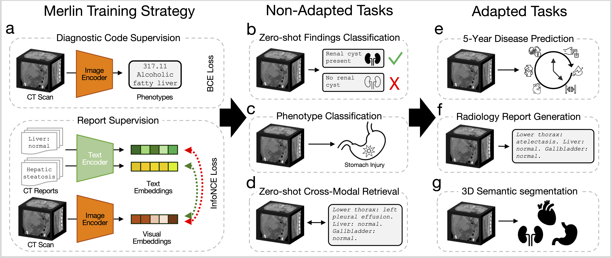

# Merlin: Vision Language Foundation Model for 3D Computed Tomography

*Merlin is a 3D VLM for computed tomography that leverages both structured electronic health records (EHR) and unstructured radiology reports for pretraining.*

[[📄 Paper](https://arxiv.org/abs/2406.06512)] [[🤗 Hugging Face](https://huggingface.co/louisblankemeier/Merlin)]



## Installation

1. **Clone the repository:**
    ```bash
    git clone https://github.com/louisblankemeier/merlin
    cd merlin
    ```

2. **Create a new Conda environment:**
    ```bash
    conda create --name merlin_env python=3.9
    ```

3. **Activate the Conda environment:**
    ```bash
    conda activate merlin_env
    ```

4. **Install the project dependencies:**
    ```bash
    pip install -e .
    ```

## Running inference on a demo CT scan

